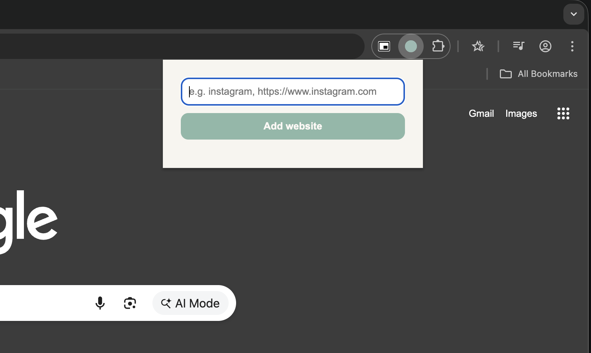
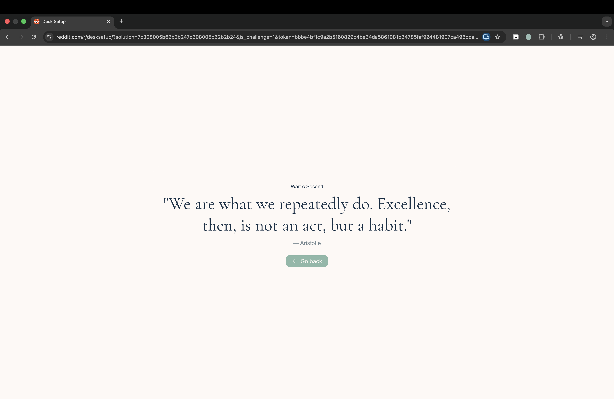
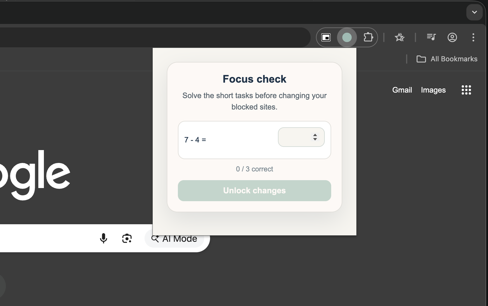
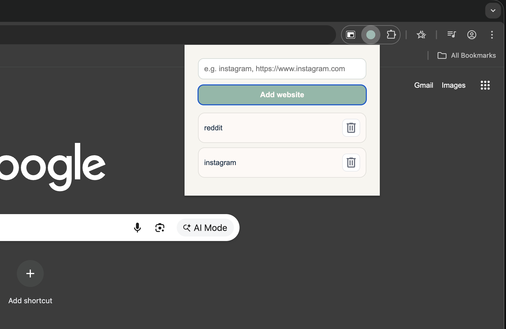

# StopIt

Ist eine Chrome Extension, die dich aktiv davon abhält, Zeit auf ablenkenden Websites zu verschwenden.

Anstatt nur zu blockieren, zwingt dich StopIt dazu, deine Entscheidungen bewusst zu hinterfragen.

---

## Features

- **Website-Blocking**  
  Blockiere beliebige Websites durch Eingabe der URL

- **Kein einfacher Zugriff**  
  Sobald eine Seite blockiert ist, kannst du sie nicht mehr direkt öffnen und nur noch zurückgehen

- **Motivierende Quotes**  
  Beim Blockieren wird ein Zitat einer bekannten Persönlichkeit angezeigt, das zum Nachdenken anregt

- **Bewusste Kontrolle durch Rechenaufgaben**  
  Um Websites hinzuzufügen oder zu entfernen, musst du mathematische Aufgaben lösen.  
  Das schafft eine bewusste Hürde, damit du nicht impulsiv handelst

---

## Zukünftige Funktionen

- **Notizfunktion**  
  Möglichkeit, Gedanken festzuhalten: wie du dich gefühlt hast und warum du eine Website entfernen wolltest

- **Anpassbarer Schwierigkeitsgrad**  
  Lege fest, wie anspruchsvoll die Aufgaben sein sollen – je nach „Suchtfaktor“ der jeweiligen Website

---

## Screenshots

### Blockierte Website

### Quote Anzeige

### Rechenaufgabe

### Einstellungen / Website hinzufügen

---

## Installation

1. Repository klonen:
   git clone https://github.com/your-username/StopIt.git

2. Öffne Google Chrome

3. Gehe zu:
   chrome://extensions/

4. Aktiviere oben rechts den **Developer Mode**

5. Klicke auf **"Load unpacked"** (Entpackte Erweiterung laden)

6. Wähle den zuvor geklonten Projektordner aus

7. Stelle sicher, dass die Extension aktiviert ist (Toggle im Extensions-Tab)

8. Optional: Pinne die Extension in der Chrome Toolbar für schnellen Zugriff
